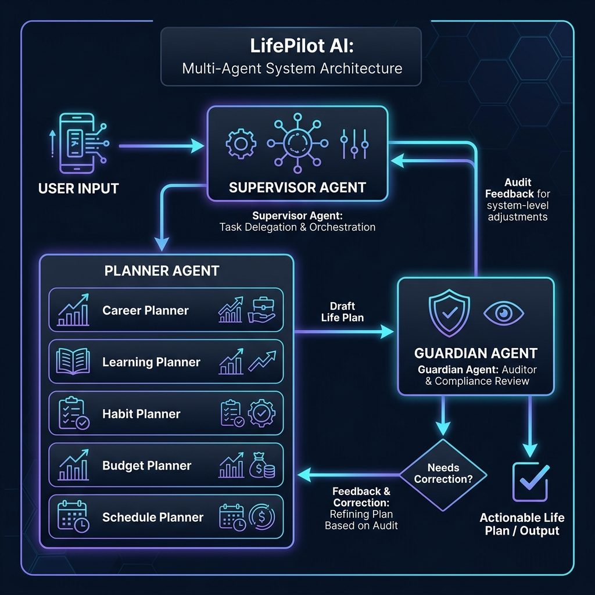

# LifePilot AI

**LifePilot AI turns one compound life goal into a single reconciled, safety-audited plan.**

---

## The Problem Statement

When individuals create personal growth roadmaps, they typically have multiple goals in mind (e.g., *"I want to switch careers, study machine learning, jog daily, and save $500/month"*). Standard Large Language Models (LLMs) and monolithic assistants struggle with three critical challenges when handling these compound goals:

1. **Cross-Domain Inconsistency**: Plans are generated in isolation. A learning plan that demands 30 hours/week, a health routine requiring 2 hours/day, and a full-time job can easily exceed a 24-hour day. 
2. **Guardrail Violations**: High-stakes domains require strict boundaries. Giving specific investment recommendations (e.g., *"buy Apple stock"*) violates financial advising guidelines, and prescribing specific daily calorie bounds (e.g., *"eat exactly 1600 kcal"*) poses medical risks.
3. **State Loss on Updates**: Requesting minor revisions (e.g., *"change my savings rate to $600/month"*) forces monolithic systems to regenerate the entire plan from scratch, discarding progress, context, and unrelated domains (such as the study roadmap).

---

## Solution Overview & Multi-Agent Design

LifePilot AI addresses these challenges using a **hierarchical multi-agent network** designed around division of labor, safety auditing, and closed-loop feedback:

- **Division of Labor**: Decomposes the compound goal into parallel domain-specific sub-plans drafted by specialized planners.
- **Independent Guardian Audit**: A dedicated compliance agent reviews the compiled plan against strict safety guidelines, preventing unsafe advice from ever reaching the user.
- **Closed-Loop Reconciliation ("U-Turn" Loop)**: If an audit fails, the orchestrator routes the draft back to the planners with instructions on how to correct the errors, repeating the cycle until compliance is verified.
- **Targeted Regeneration**: Follow-up modifications analyze the state, update only the affected domains, and preserve the rest of the plan unchanged.

---

## System Architecture

The system utilizes exactly three collaborating agents (Lead Supervisor, Domain Planners, and the Guardian auditor) cooperating to draft and verify plans.



1. **Lead Supervisor Agent**:
   - Parses the initial goal and decomposes it into structured Pydantic schemas.
   - Coordinates parallel execution of domain planners.
   - Orchestrates the verification loop and performs targeted updates when follow-ups are received.
2. **Domain Planners**:
   - **Career Planner**: Formulates milestone-based career roadmaps.
   - **Learning Planner**: Utilizes Google Search Grounding to find, format, and embed active tutorial and documentation links.
   - **Habit Planner**: Outlines healthy habit routines without specific calories or macronutrient numbers.
   - **Budget Planner**: Formulates general savings allocations, strictly avoiding specific stock/securities advice.
   - **Schedule Planner**: Fuses all active sub-plans into structured calendar slots.
3. **Guardian Agent**:
   - Audits plan safety and rejects drafts that contain caloric/macro numbers, recommend specific stocks, lack disclaimers, or contain temporal scheduling overloads.

---

## Key Concepts Demonstrated

| Concept | Description in LifePilot AI |
| :--- | :--- |
| **Multi-Agent Orchestration** | Implements a **custom orchestrator** in [agents/supervisor.py](agents/supervisor.py) (not using ADK) that handles task delegation, state preservation, and closed-loop correction. |
| **Security Features** | Zero hardcoded keys in source code. Credentials are loaded strictly from environment variables, and the Guardian agent actively scrubs unauthorized advice before presentation. |
| **Deployability** | Production-ready packaging with [Dockerfile](Dockerfile) and [deploy.sh](deploy.sh) script for simple GCP Cloud Run container deployment. |
| **Tool Use** | Incorporates live Google Search Grounding for learning plans and compiles calendar payloads into downloadable `.ics` files. |
| **Model Context Protocol** | Standalone FastAPI application that communicates directly with Gemini API. *(Does not expose or run an internal MCP server).* |

---

## Tech Stack

- **Backend**: Python 3.11+, **FastAPI** (NDJSON streaming)
- **Frontend**: Single Page Application using vanilla **HTML5, CSS3 (Vanilla CSS), and JS**
- **LLM SDK**: Google GenAI SDK (`gemini-2.5-flash` local default, with `gemini-flash-lite-latest` fallback support)
- **Deployment**: Docker, Google Cloud Run, Vertex AI (by setting `USE_VERTEX=true`)

---

## Getting Started & Local Run

### 1. Prerequisites
- Python 3.11+
- A Google Gemini API Key (obtained from [Google AI Studio](https://aistudio.google.com/))

### 2. Installation & Setup

1. **Clone the repository**:
   ```bash
   git clone https://github.com/priyakselvaraj/lifepilot-ai.git
   cd lifepilot-ai
   ```

2. **Create a virtual environment**:
   ```bash
   python3 -m venv .venv
   source .venv/bin/activate
   ```

3. **Install dependencies**:
   ```bash
   pip install -r requirements.txt
   ```

4. **Configure Environment Variables**:
   Create a `.env` file in the root directory (reference [`.env.example`](.env.example)):
   ```env
   GEMINI_API_KEY="your-actual-api-key-here"
   GEMINI_MODEL="gemini-flash-lite-latest"
   ```

5. **Run the local server**:
   ```bash
   uvicorn main:app --reload --port 8000
   ```
   Open your browser and navigate to `http://127.0.0.1:8000` to run the application.

---

## GCP Deployment (Scale & Quota Resolution)

To bypass local AI Studio request quotas (20 requests per day), you can deploy the Docker container to Google Cloud Run and route requests through **Vertex AI**:

```bash
# Deploys container to Cloud Run and enables keyless Vertex AI authentication
export USE_VERTEX=true
export GEMINI_MODEL=gemini-2.5-flash
bash deploy.sh
```

---

## Limitations

- **General Guidance Only**: LifePilot AI provides general healthy-habit and budgeting advice. It does not replace certified professional advice.
- **Single-User State**: The current local implementation stores user state in a single file (`data/user_state.json`), serving as a demonstration prototype.
